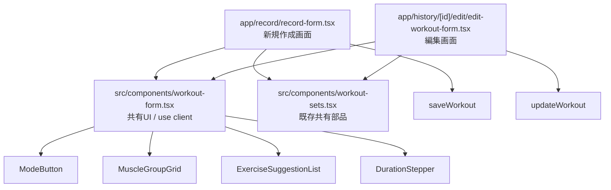

# 設計書: 編集画面と新規作成画面のUI統一

- 作成日: 2026-07-13
- 作成者: Codex
- ステータス: 実装待ち
- 参照要件: `docs/SPECIFICATION_REQUIREMENTS_EDIT_FORM_UI_UNIFICATION.md`
- 参照技術選定: `docs/SPECIFICATION_TECH_EDIT_FORM_UI_UNIFICATION.md`
- 対象実装: 未コミットの作業ツリーにある `src/components/workout-form.tsx`、`app/record/record-form.tsx`、`app/history/[id]/edit/edit-workout-form.tsx`

本書は、ワークアウト新規作成画面と編集画面のUI統一について、基本設計と詳細設計をまとめたものである。実装の責務を共有UIと画面固有の状態・副作用に分離し、見た目の再乖離を防ぐことを目的とする。

設計判断の表記は次のとおりとする。

- `確定`: 要件または現行実装に基づき、この設計で固定する事項
- `候補`: 採用可能だが、現時点では実装・仕様として固定しない事項
- `要検証`: 実機・ブラウザ確認、または追加判断が必要な事項

## 1. 基本設計

### 1.1 目的

1. `/record` と `/history/[id]/edit` の種目入力UIを、新規作成画面のスタイルを基準に統一する。
2. ローカルに重複していたUI部品を共有化し、今後のスタイル・モーションの乖離を構造的に減らす。
3. 編集画面の「既存種目をカード単位で同時編集する」操作モデルと、保存・Undo・サジェスト適用などの既存挙動を維持する。

### 1.2 統一方針

#### 基準画面

**確定**: 新規作成画面をUIの基準とする。

理由は以下のとおりである。

- 新規作成画面の方が、タップターゲット、余白、部位情報、入力補助の表現が整理されている。
- `h-12` のモードボタン、`p-3.5` の部位タイル、部位色と英語名、前回値サブタイトル、プレースホルダが、入力内容を理解しやすくする。
- 既存の新規作成画面の見た目を基準にすることで、既存利用者への変更を最小限にしながら編集画面を改善できる。
- 新規作成画面で既に使用されているスタイルを共有コンポーネントへ移すため、移行後の差分を小さくできる。

#### 編集画面の操作モデル

**確定**: 編集画面の操作モデルは変更しない。

編集画面は、保存済みワークアウトの全種目をカードとして表示し、各カード内で種目タイプ、種目名、部位、セットまたは時間を編集する。新規作成画面の「1種目ずつ入力してサマリーカードに追加する」モデルへ置き換えない。

これは、編集時に既存種目の並びと複数種目の編集状態を保持する必要があり、モデルを変更すると既存種目の編集性が失われるためである。共有するのは表示・入力UIの部品であり、状態管理、更新処理、Undo、保存処理は各画面に残す。

### 1.3 コンポーネント構成



共有ファイルは `"use client"` を持つ。4コンポーネントは画面から値とコールバックを受け取り、画面固有の保存処理や状態を直接参照しない。

### 1.4 責務境界

| レイヤー | 責務 | 保持しないもの |
| --- | --- | --- |
| `src/components/workout-form.tsx` | 共通のDOM、クラス、入力補正、候補選択イベント、表示用サブタイトル、モーション | ワークアウト全体、候補の検索条件、保存処理、Undo履歴 |
| `app/record/record-form.tsx` | 新規入力のフラットな状態、候補の絞り込み、テンプレート変換、追加・削除Undo、`saveWorkout` | 共有部品のスタイル定義 |
| `app/history/[id]/edit/edit-workout-form.tsx` | `LocalExercise[]`、カード単位の更新、候補適用、セット・種目Undo、`updateWorkout` | 共有部品のローカル複製定義 |
| `src/components/workout-sets.tsx` | セット行の表示、追加、削除、重量・回数入力 | 本テーマの対象4部品のスタイル |

## 2. 詳細設計

### 2.1 共有コンポーネント共通仕様

**確定**: 共有コンポーネントは画面から制御値を受け取る制御コンポーネントとする。内部にワークアウト状態を持たず、値の変更はコールバックで親へ通知する。

**確定**: 色、角丸、文字サイズ、背景、罫線は既存のMACHOデザイントークンを優先する。

主なトークンは以下のとおりである。

| 用途 | トークンまたは既存クラス |
| --- | --- |
| 強調色 | `macho-lime`（`#d4ff00`） |
| ページ背景 | `macho-black` / `macho-base` |
| 入力面 | `macho-surface`（`#141416`） |
| カード面 | `macho-card`（`#1a1a1e`） |
| 罫線 | `macho-border`（`#2a2a30`） |
| ホバー時罫線 | `macho-border-hover`（`#555555`） |
| 通常文字 | `macho-text` |
| 補助文字 | `macho-muted` |
| 小・中・大の角丸 | `rounded-macho-s` / `rounded-macho-m` / `rounded-macho-l` |
| 数値表示 | `font-display`、`text-display-num` 相当の既存タイポグラフィ |

### 2.2 `ModeButton`

#### Props

| Prop | 型 | 必須 | 仕様 |
| --- | --- | --- | --- |
| `active` | `boolean` | 必須 | 選択中かどうか。選択状態の色を切り替える。 |
| `icon` | `React.ReactNode` | 必須 | 画面側から渡すアイコン。現行利用では `Dumbbell` または `Activity` の `size={16}`。 |
| `children` | `React.ReactNode` | 必須 | ボタンラベル。`筋トレ` または `有酸素`。 |
| `onClick` | `() => void` | 必須 | モード変更時の画面固有処理。 |

#### スタイル

- 要素: `motion.button`、`type="button"`
- レイアウト: `flex h-12 items-center justify-center gap-2`
- 形状: `rounded-macho-m border`
- 文字: `text-sm font-medium`
- 選択中: `border-macho-lime bg-macho-lime/10 text-macho-lime`
- 非選択: `border-macho-border bg-macho-card text-macho-muted hover:text-macho-text`
- 共通: `transition`

#### モーション・アクセシビリティ

- 通常時は `whileTap={{ scale: 0.97 }}` とする。
- `useReducedMotion()` が有効な場合は `whileTap` を `undefined` とし、押下時の縮小を行わない。
- ボタンの意味はラベルとアイコンで伝え、処理は `onClick` に委譲する。
- `aria-pressed={active}` を付与し、支援技術へモードの選択状態を伝える。

### 2.3 `MuscleGroupGrid`

#### Props

| Prop | 型 | 必須 | 仕様 |
| --- | --- | --- | --- |
| `groups` | `MuscleGroup[]` | 必須 | `id`、`name`、`name_en`、`color` を持つ部位一覧。 |
| `selectedId` | `string \| null` | 必須 | 現在選択されている部位ID。 |
| `onSelect` | `(id: string) => void` | 必須 | タイル選択時に部位IDを返す。 |

#### スタイル

- 外枠: `grid grid-cols-3 gap-2`
- タイル: `rounded-macho-m border p-3.5 text-center transition`
- 選択中: `border-macho-lime bg-macho-lime/5`
- 非選択: `border-macho-border bg-macho-card hover:border-macho-border-hover`
- 部位名: `mb-1 block text-[22px] font-semibold`、`group.color` を文字色に使用
- 英語名: `text-[11px]`、選択中は `text-macho-lime`、非選択は `text-macho-muted`
- 部位名の表示文字列は `shortMuscleName(group.name)` を使用する。

#### モーション・アクセシビリティ

- 通常時は各タイルに `whileTap={{ scale: 0.97 }}` を設定する。
- `useReducedMotion()` が有効な場合は `whileTap` を無効にする。
- 各タイルは `type="button"` とし、フォーム送信を発生させない。
- 選択状態は色と部位名下の英語名の色で表現する。

### 2.4 `ExerciseSuggestionList`

#### Props

| Prop | 型 | 必須 | 仕様 |
| --- | --- | --- | --- |
| `entries` | `ExerciseHistoryEntry[]` | 必須 | 画面側で種目タイプ・入力文字列により絞り込んだ候補。 |
| `onSelect` | `(entry: ExerciseHistoryEntry) => void` | 必須 | 候補選択時に履歴エントリ全体を返す。 |
| `className` | `string` | 任意 | 親の配置に合わせた追加クラス。既定値は空文字。 |

#### 表示・スタイル

- 要素: `motion.ul`
- 配置: `absolute top-[calc(100%-4px)] z-20`
- 大きさ・スクロール: `max-h-64 overflow-y-auto`
- 外観: `rounded-macho-s border border-macho-border bg-macho-surface shadow-lg`
- 行ボタン: `flex w-full flex-col items-start gap-0.5 px-3.5 py-2.5 text-left`
- 行境界: `border-b border-macho-border/60 last:border-b-0`
- 種目名: `text-sm text-macho-text`
- 前回値: `text-[11px] text-macho-muted`
- 各行のキーは `entry.exercise_name` とする。

#### サブタイトル規則

- 有酸素かつ前回時間がある場合: `前回: {last_duration_minutes}分`
- 筋トレかつ前回セットがある場合: `前回: {formatSetsSummary(last_sets)}`
- 前回値がない場合: `前回の記録なし`

#### イベント・モーション

- 候補ボタンは `onPointerDown` で `event.preventDefault()` を実行してから `onSelect(entry)` を呼ぶ。入力欄のblurで候補適用が失われることを防ぐ。
- 通常時の表示開始は `opacity: 0, scale: 0.96`、表示後は `opacity: 1, scale: 1` とする。
- reduced-motion時の表示開始はopacityのみとする。
- `transformOrigin` は `top` とする。
- 速度は `transitionFor(Boolean(reduced))` を利用する。通常時は既存の標準spring、reduced-motion時は短い通常遷移を使用する。

### 2.5 `DurationStepper`

#### Props

| Prop | 型 | 必須 | 仕様 |
| --- | --- | --- | --- |
| `label` | `string` | 必須 | 表示ラベルおよび数値入力の `aria-label`。現行値は `時間 (分)`。 |
| `value` | `number` | 必須 | 現在の時間。 |
| `min` | `number` | 必須 | 下限値。現行利用では `1`。 |
| `step` | `number` | 必須 | 増減幅。現行利用では `5`。 |
| `onChange` | `(value: number) => void` | 必須 | 補正済みの時間値を親へ返す。 |

#### スタイル・操作

- 外枠は既存 `Card` を使用し、追加クラスは `px-1.5 py-3 text-center`。
- ラベルは `mb-1.5 text-[11px] text-macho-muted`。
- 操作列は `flex items-center justify-center gap-2`。
- 増減ボタンは既存 `PressAndHoldStepperButton` を利用し、`min-h-11 min-w-11`、丸型、罫線、`macho-surface` 背景を維持する。
- 数値入力は `type="number"`、`inputMode="decimal"`、`min`、`step`、`aria-label` を設定する。
- 数値は `font-display text-[26px] leading-none tracking-[0.04em] text-macho-lime`。
- 空文字は `min` に戻し、数値入力は `Math.max(min, value)` で下限を保証する。
- 長押しによる連続増減は `PressAndHoldStepperButton` の既存挙動に委譲する。
- `PressAndHoldStepperButton` 内部で `useReducedMotion` を使用し、reduced-motion時は `whileTap` を無効化する。`DurationStepper` からpropを渡す方式は採用しない。この対応は `SetRowsEditor` の `MiniStepper` など、同ボタンの全利用箇所に波及する。

### 2.6 画面別の利用箇所と配置

#### 新規作成画面 `/record`

| 部品 | 利用箇所・親配置 | 親から渡す値・処理 |
| --- | --- | --- |
| `ModeButton` | フォーム上部。`mt-4 grid grid-cols-2 gap-2` | `exerciseType` を選択状態にし、`chooseExerciseType` で種目名と候補表示をリセットする。 |
| `MuscleGroupGrid` | 筋トレ時。直前に `mb-2 mt-4 text-xs` の「部位を選択」ラベルを配置 | `selectedMuscleId` と `chooseMuscle`。 |
| `ExerciseSuggestionList` | 種目名入力を含む `Card className="relative mt-4"` 内 | `filteredSuggestions`、`applySuggestion`、`className="left-4 right-4"`。 |
| `DurationStepper` | 有酸素時。`mt-3.5` の外側div内 | `durationMinutes`、`setDurationMinutes`、`min={1}`、`step={5}`。 |

新規作成画面では、共有部品のほかに `SetRowsEditor` を使う。入力中の種目は `setRows` に保持し、追加済み種目は `exercises` のサマリーカードに表示する。

#### 編集画面 `/history/[id]/edit`

| 部品 | 利用箇所・親配置 | 親から渡す値・処理 |
| --- | --- | --- |
| `ModeButton` | 各種目 `Card` のヘッダー。削除ボタンと並ぶ `flex items-center justify-between gap-2` 内の `grid flex-1 grid-cols-2 gap-2` | `exercise.exercise_type` と `setExerciseType(index, type)`。タイプ切替時は編集対象種目を既定値でpatchする。 |
| `MuscleGroupGrid` | 筋トレ種目カード内。`mb-2 text-xs` の「部位を選択」ラベルの直下 | `exercise.muscle_group_id` と、`patchExercise(index, { muscle_group_id: id, muscle_sub_group_ids: [] })`。 |
| `ExerciseSuggestionList` | 種目名入力を含む `relative` div内 | `suggestionsFor(exercise)`、`applySuggestion(index, entry)`、`className="left-0 right-0"`。 |
| `DurationStepper` | 有酸素種目カード内。カードの `space-y-3` の一要素 | `exercise.duration_minutes ?? 0` と `patchExercise(index, { duration_minutes: value })`、`min={1}`、`step={5}`。 |

編集画面では、サジェストとステッパーの横幅をカード内いっぱいにするため、サジェストの左右配置だけ新規作成画面と異なる。共有部品の内部スタイルは同じであり、差分は親のレイアウトと `className` に限定する。

### 2.7 スコープ注記

**確定**: 既存の `hover:border-[#555]` を意味的トークンへ機械置換する範囲で、次のファイルにも触れる。

- `src/components/workout-form.tsx`
- `src/components/ui.tsx` の `Pill`
- `app/templates/page.tsx`
- `app/onboarding/onboarding-form.tsx`

`app/globals.css` の `@theme inline` に `--color-macho-border-hover: #555555;` を追加し、上記4箇所を `hover:border-macho-border-hover` に置換する。これは見た目を変えない意味的トークン化である。`app/page.tsx` の `text-[#555]` はテキスト色であり、今回の置換対象外とする。

`src/components/ui.tsx` の `BottomNav` にある既存の `flex` から `grid` への差分は、引き続き本テーマの対象外とする。

### 2.8 状態管理と境界

#### 新規作成画面の状態

**確定**: `record-form.tsx` の既存フラットstateを維持する。

- `workoutDate`: ワークアウト日
- `exerciseType`: 現在入力中の種目タイプ
- `selectedMuscleId`: 現在入力中の部位
- `exerciseName`: 現在入力中の種目名
- `showSuggestions`: 候補リストの表示状態
- `setRows`: 現在入力中の筋トレセット
- `durationMinutes`: 現在入力中の有酸素時間
- `exercises`: 追加済み種目の配列
- `pendingDeletionRef`: セット・種目削除Undoの現在1件分のトークン、toast ID、期限

共有部品はこれらを保持せず、`value`、`selectedId`、`entries` と各コールバックを受け取る。

#### 編集画面の状態

**確定**: `edit-workout-form.tsx` の `LocalExercise[]` 配列を維持する。

`LocalExercise` は `NewExercisePayload` に `local_key` を追加した画面内編集モデルである。`patchExercise(index, patch)` が配列要素を更新し、共有部品からのイベントをこの関数へ接続する。

- `date`: 編集対象の日付
- `openSuggestionsIndex`: 候補を表示する種目カードのindex
- `exercises`: 全種目の編集状態
- `pendingDeletionRef`: 種目またはセット削除Undoの現在1件分
- `isPending`: `updateWorkout` 実行中状態

共有部品と画面状態の境界は次のとおりである。

```text
共有部品のイベント
  -> 画面のコールバック
  -> 画面state更新 / toast / router / server action

候補リストは候補を検索しない
  -> 画面が exerciseHistory から絞り込んで entries を渡す

部位タイルは sub group を直接管理しない
  -> 編集画面の onSelect が muscle_sub_group_ids を [] にして patchする
```

## 3. テスト設計

### 3.1 自動検証

**確定**: Vitest、React Testing Library等のテスト基盤は導入しない。検証は型チェック、lint、差分チェック、ブラウザ手動確認で行う。

| ID | 検証項目 | 実施内容 | 成功条件 |
| --- | --- | --- | --- |
| T-01 | 型チェック | `npx tsc --noEmit` | 終了コード0。共有props、画面側コールバック、型importにエラーがない。 |
| T-02 | lint | `npm run lint` | 終了コード0。未使用import、hooks規則、JSXエラーがない。 |
| T-03 | ローカル定義除去 | 2画面で `ModeButton`、`MuscleGroupGrid`、`ExerciseSuggestionList`、`DurationStepper` の関数定義を検索 | 対象4部品のローカル定義がなく、共有モジュールからimportされている。 |
| T-04 | 差分整合性 | `git diff --check` | 空白エラーがない。`src/components/ui.tsx` の対象外差分を混入させない。 |

### 3.2 新規作成画面の機能確認

| ID | 操作 | 確認内容 |
| --- | --- | --- |
| R-01 | 筋トレ/有酸素を切り替える | `exerciseType` が切り替わり、種目名と候補表示がリセットされる。 |
| R-02 | 部位タイルを選択する | `selectedMuscleId` が更新され、選択色・部位名・英語名が表示される。 |
| R-03 | 種目名入力・候補選択 | 入力文字列で候補が絞り込まれ、候補選択で種目名、部位、前回セットまたは時間が反映される。候補のblur取りこぼしがない。 |
| R-04 | セットを追加・削除する | `SetRowsEditor` が動作し、セット削除後にUndoで元の位置へ復元される。 |
| R-05 | 種目を追加・削除する | サマリーカードに追加され、種目削除後にUndoで元の位置へ復元される。 |
| R-06 | 有酸素時間を変更する | `min=1`、`step=5`、直接入力、増減ボタン、長押しが期待どおりに動作する。 |
| R-07 | 保存する | 入力中の種目を含めて `saveWorkout` が呼ばれ、成功時にダッシュボードへ遷移する。 |

### 3.3 編集画面の機能確認

| ID | 操作 | 確認内容 |
| --- | --- | --- |
| E-01 | 種目カードのモードを切り替える | 対象indexだけが更新され、既存の全種目カードが維持される。 |
| E-02 | 部位を変更する | 対象種目の `muscle_group_id` が更新され、`muscle_sub_group_ids` が空配列にリセットされる。他カードは変化しない。 |
| E-03 | 筋トレ候補を適用する | 対象indexに種目名、部位、前回セット、`sets`、先頭セットの重量・回数が反映され、候補が閉じる。 |
| E-04 | 有酸素候補を適用する | 対象indexに種目名と前回時間が反映され、候補が閉じる。 |
| E-05 | セットを追加・編集・削除する | 対象カードのセットだけが更新され、削除Undoで指定位置に復元される。先頭セット変更時の重量・回数同期も確認する。 |
| E-06 | 種目を追加・削除する | 筋トレ追加・有酸素追加でカードが増え、種目削除Undoで元の位置と内容に復元される。 |
| E-07 | 複数操作のUndo | 新しい削除で前のUndoトーストが置き換わり、期限切れ・別トークンのUndoが状態を壊さない。 |
| E-08 | 保存する | 日付・全カードの編集内容を `updateWorkout` へ渡し、成功時に履歴へ遷移する。 |

### 3.4 UI・アクセシビリティ確認

| ID | 検証項目 | 成功条件 |
| --- | --- | --- |
| A-01 | 見た目の統一 | 両画面でモードボタン、部位タイル、候補リスト、時間ステッパーの共有部分が同じ高さ・余白・色・角丸になる。 |
| A-02 | 配置差分 | 新規作成は候補が `left-4 right-4`、編集は `left-0 right-0` で、各親コンテナ内に正しく収まる。 |
| A-03 | タップターゲット | ステッパー、削除ボタン、Undoボタンに既存の `min-h-11` / `min-w-11` 水準がある。 |
| A-04 | reduced-motion | `prefers-reduced-motion` 有効時、モード・部位タイルの押下縮小、候補表示のscale、`PressAndHoldStepperButton` の押下縮小を抑制する。ステッパーは全利用箇所に波及する。 |
| A-05 | モバイル表示 | 画面幅390px前後でカード、3列部位グリッド、候補リスト、削除ボタンが横溢れしない。 |
| A-06 | モードのアクセシビリティ | `ModeButton` のDOMに `aria-pressed={active}` が反映され、筋トレ・有酸素の選択状態と一致する。 |

## 4. 既知の課題

### K-01: MuscleGroupGridのホバー色トークン化（解決済み・実装待ち）

- 区分: **確定（技術選定で解決済み・実装待ち）**
- 対応: `app/globals.css` の `@theme inline` に `--color-macho-border-hover: #555555;` を追加し、4箇所の `hover:border-[#555]` を `hover:border-macho-border-hover` に機械置換する。
- 対象: `src/components/workout-form.tsx`、`src/components/ui.tsx` の `Pill`、`app/templates/page.tsx`、`app/onboarding/onboarding-form.tsx`
- 備考: 実装コードはまだ変更していないため、現在の作業ツリーには置換前のリテラルが残っている。

### K-02: DurationStepperの押下モーション低減境界（解決済み・実装待ち）

- 区分: **確定（技術選定で解決済み・実装待ち）**
- 対応: `src/components/stepper.tsx` の `PressAndHoldStepperButton` 内部で `useReducedMotion` を使用し、reduced-motion時に `whileTap` を無効化する。
- 不採用: `DurationStepper` からpropを渡す方式。
- 波及範囲: `DurationStepper` と `SetRowsEditor` の `MiniStepper` など、`PressAndHoldStepperButton` の全利用箇所。
- 備考: 通常ユーザーの見た目は変えず、実装コードはまだ変更していない。

### K-03: ブラウザ上の視覚・操作確認が未完了

- 区分: **要検証**
- 差異: 型チェックとlintは実施済みだが、390px前後の実ブラウザでの見た目、候補選択、Undo、保存成功、reduced-motion、`aria-pressed` までの一連操作は設計書作成時点で確認していない。
- 影響: CSSの重なり、候補リストの表示位置、タッチイベント、実データを使った保存連携の問題を静的検査だけでは検出できない。
- 対応方針: 3.2〜3.4の手動またはブラウザテストを実施し、結果を受け入れ記録に残す。

### K-04: `ModeButton` の `aria-pressed`（解決済み・実装待ち）

- 区分: **確定（技術選定で解決済み・実装待ち）**
- 対応: `ModeButton` に `aria-pressed={active}` を付与する。
- 影響: 既存の `active` propを利用するため、共有コンポーネントのAPI変更や操作モデルの変更はない。
- 備考: 実装コードはまだ変更していないため、A-06のブラウザ確認が必要である。

## 5. 未決事項

1. **要検証**: K-03のブラウザ実機確認を実施する環境、実データを使った保存確認のテストアカウント・データ、および検証結果の記録方法。

## 6. 受け入れ判定

設計上の受け入れ条件は、要件定義書のFR-1〜FR-4、NFR-1〜NFR-4、および本書3章のテスト項目を満たすこととする。

現時点では、型チェック・lint・共有化構造・主要なコールバック接続は確認済みである。K-01、K-02、K-04は技術選定により設計上解決済みであり、実装を待つ。K-03のブラウザ確認のみ未検証であるため、本設計書のステータスは `実装待ち` とする。
